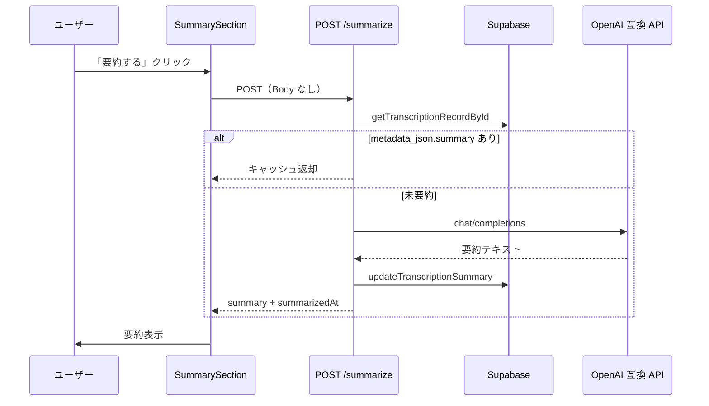

# 音声認識履歴を LLM で要約する — Next.js BFF + metadata_json キャッシュ

AmiVoice で音声認識したテキストを DB に保存し、履歴詳細画面から **OpenAI 互換 API（Gemini / OpenAI など）で要約** する機能の実装メモです。フェーズ1の英→日翻訳と同じ `LLM_*` 環境変数を流用し、**専用カラムを増やさず `metadata_json` にキャッシュ** する構成にしています。

## この記事でわかること

- 変換履歴詳細ページから要約を生成する処理フロー
- フェーズ1（翻訳）と共通の `LLM_*` 環境変数の設定方法
- Route Handler → LLM アダプター → Supabase 保存までの実装パターン
- 2 回目以降は LLM を呼ばずキャッシュを返す設計
- 502 エラー時の切り分けポイント

## 想定読者・環境

- Next.js App Router で BFF（Route Handler）から LLM を呼びたい方
- AmiVoice 認識結果を Supabase にテキストとして保存している構成
- フェーズ1で英→日翻訳（`llm-translator.ts`）を既に導入済み、または同等の LLM 連携がある方

本記事のコード例は TypeScript / Next.js 15 前提です。LLM 側は **OpenAI Chat Completions 互換** のエンドポイントを想定しています。

## 機能概要

| 項目 | 内容 |
| ---- | ---- |
| 画面 | `/speech/history/{id}`（変換履歴詳細） |
| 操作 | 「要約する」ボタンをクリック |
| 要約対象 | `final_text`（表示・保存用の最終テキスト） |
| LLM | OpenAI 互換 API（Gemini / OpenAI など） |
| 保存先 | `t_transcription_record.metadata_json`（JSONB） |

:::message
音声ファイル自体は DB に保存していません。AmiVoice 認識 →（必要なら翻訳）→ 保存された **テキスト** を要約します。
:::

## 処理フロー



要点は次の 3 点です。

1. **BFF 経由** — クライアントは `/api/speech/history/{id}/summarize` を叩くだけ。API キーはサーバー側のみ。
2. **キャッシュ優先** — `metadata_json.summary` があれば LLM を呼ばない。
3. **翻訳と同型** — `llm-summarizer.ts` は `llm-translator.ts` と同じ fetch パターン。

## 環境変数

フェーズ1（英→日翻訳）と同じ `LLM_*` を流用します。**追加の env は不要** です。

| 変数 | 用途 |
| ---- | ---- |
| `LLM_API_KEY` | API キー（Gemini は [Google AI Studio](https://aistudio.google.com/) から取得） |
| `LLM_API_BASE_URL` | OpenAI 互換ベース URL |
| `LLM_MODEL` | モデル名 |

Gemini の設定例（`frontend/web/.env.local`）:

```env
LLM_API_KEY=AIza...
LLM_API_BASE_URL=https://generativelanguage.googleapis.com/v1beta/openai
LLM_MODEL=gemini-2.0-flash
```

:::message alert
`.env.local` を変更したら Next.js dev サーバーを再起動してください。起動時に env を読み込むため、再起動しないとキー未設定扱いになります。
:::

## 実装の構成

| 役割 | 配置例 |
| ---- | ------ |
| LLM アダプター | `features/speech/adapters/llm-summarizer.ts` |
| DB 更新 | `features/speech/adapters/transcription-repository.ts` |
| API Route | `app/api/speech/history/[id]/summarize/route.ts` |
| UI（Client） | `app/(dashboard)/speech/history/[id]/_components/SummarySection.tsx` |
| 詳細ページ | `app/(dashboard)/speech/history/[id]/page.tsx` |

### LLM アダプター

翻訳用アダプターと同型の fetch 実装です。エンドポイントは `${LLM_API_BASE_URL}/chat/completions`、temperature は `0.2` に固定しています。

```typescript
const MAX_INPUT_LENGTH = 8000;

export async function summarizeText(text: string): Promise<string> {
  const trimmed = text.trim();
  if (!trimmed) {
    throw new LlmSummarizationError("要約対象テキストが空です");
  }

  const input =
    trimmed.length > MAX_INPUT_LENGTH
      ? trimmed.slice(0, MAX_INPUT_LENGTH)
      : trimmed;

  const apiKey = process.env.LLM_API_KEY;
  const baseUrl =
    process.env.LLM_API_BASE_URL?.replace(/\/$/, "") ??
    "https://api.openai.com/v1";
  const model = process.env.LLM_MODEL ?? "gpt-4o-mini";

  if (!apiKey) {
    throw new LlmSummarizationError("LLM_API_KEY が設定されていません");
  }

  const response = await fetch(`${baseUrl}/chat/completions`, {
    method: "POST",
    headers: {
      "Content-Type": "application/json",
      Authorization: `Bearer ${apiKey}`,
    },
    body: JSON.stringify({
      model,
      messages: [
        {
          role: "system",
          content:
            "音声認識テキストを日本語で3〜5行に要約してください。箇条書き可。説明や前置きは不要です。",
        },
        { role: "user", content: input },
      ],
      temperature: 0.2,
    }),
  });

  if (!response.ok) {
    throw new LlmSummarizationError(
      `要約 API がエラーを返しました (${response.status})`,
    );
  }

  const json = (await response.json()) as {
    choices?: Array<{ message?: { content?: string } }>;
  };

  const summary = json.choices?.[0]?.message?.content?.trim();
  if (!summary) {
    throw new LlmSummarizationError("要約結果が空です");
  }

  return summary;
}
```

- 入力が空 → `LlmSummarizationError`
- 8000 文字超 → 先頭 8000 文字に truncate（トークン超過防止）

### Route Handler（キャッシュ返却）

POST 時に DB からレコードを取得し、**既存の要約があれば LLM を呼ばず** 返します。

```typescript
export async function POST(_request: Request, context: RouteContext) {
  try {
    const { id } = await context.params;
    const parsed = RecordIdParamsSchema.safeParse({ id });

    if (!parsed.success) {
      return jsonError("ID が不正です", 400);
    }

    const record = await getTranscriptionRecordById(parsed.data.id);

    if (!record) {
      return jsonError("レコードが見つかりません", 404);
    }

    const cached = readCachedSummary(record.metadata_json);
    if (cached) {
      return Response.json({
        summary: cached.summary,
        summarizedAt: cached.summarizedAt,
        recordId: record.id,
      });
    }

    const summary = await summarizeText(record.final_text);
    const updated = await updateTranscriptionSummary(record.id, summary);

    return Response.json({
      summary,
      summarizedAt: new Date().toISOString(),
      recordId: updated.id,
    });
  } catch (error) {
    if (error instanceof LlmSummarizationError) {
      return jsonError(error.message, 502);
    }
    return jsonError("要約処理に失敗しました", 500);
  }
}
```

`LlmSummarizationError` は翻訳 API と同様 **502** にマッピングします。AmiVoice 認識失敗時の 502 読み方は [別記事（troubleshooting）](./troubleshooting.md) を参照してください。

### DB 保存（metadata_json マージ）

専用カラムは追加せず、既存の `metadata_json` にマージします。

```typescript
const metadataJson: Record<string, unknown> = {
  ...(existing.metadata_json ?? {}),
  summary,
  summarizedAt: new Date().toISOString(),
};
```

保存形式:

```json
{
  "summary": "要約テキスト",
  "summarizedAt": "2026-05-31T12:00:00.000Z"
}
```

- 2 回目以降の POST は LLM を呼ばず、保存済み `summary` を返します（再生成ボタンは未実装）。
- ページ再読み込み時は Server Component が `metadata_json.summary` を読み、Client Component に `initialSummary` として渡します。

## API 仕様

### `POST /api/speech/history/{id}/summarize`

**リクエスト**

- Body なし
- `id`: UUID（パスパラメータ）

**成功レスポンス（200）**

```json
{
  "summary": "・要点1\n・要点2",
  "summarizedAt": "2026-05-31T12:00:00.000Z",
  "recordId": "019..."
}
```

**エラー**

| ステータス | 条件 |
| ---------- | ---- |
| 400 | ID が UUID 形式でない |
| 404 | レコードが存在しない |
| 502 | LLM エラー（キー未設定、API 失敗、結果が空など） |
| 500 | その他のサーバーエラー |

502 時はレスポンス JSON の `error` フィールドにメッセージが入ります。

## UI 仕様

詳細ページの「最終テキスト」直下に「要約」セクションを配置しています。

| 状態 | 表示 |
| ---- | ---- |
| 未要約 | 「要約する」ボタン |
| 要約中 | ボタン disabled + 「要約中…」 |
| 成功 | 要約テキスト（border 付きブロック） |
| 失敗 | 赤文字のエラーメッセージ |
| 保存済み | 要約テキストのみ（ボタン非表示） |

クライアントからの呼び出し例:

```typescript
const res = await fetch(`/api/speech/history/${recordId}/summarize`, {
  method: "POST",
});
const data = await res.json();
// data.summary
```

Client Component 側では `initialSummary` を state の初期値にし、要約済みならボタンを出さないようにしています。

```typescript
export function SummarySection({
  recordId,
  initialSummary,
}: SummarySectionProps) {
  const [summary, setSummary] = useState<string | null>(
    initialSummary ?? null,
  );
  // ...
}
```

## 手動テスト手順

1. `/speech` で音声変換し、履歴にレコードを作成する
2. `/speech/history` から任意のレコード詳細を開く
3. 「要約する」をクリック → 要約が表示される
4. ページを再読み込み → 要約がそのまま表示され、ボタンは出ない
5. Supabase Studio 等で `metadata_json.summary` が保存されていることを確認する

## トラブルシューティング

| 症状 | 確認ポイント |
| ---- | ------------ |
| `LLM_API_KEY が設定されていません` | `.env.local` にキーがあるか、dev サーバー再起動 |
| `要約 API がエラーを返しました (401/403)` | API キーの有効性、Gemini API の有効化 |
| `要約 API がエラーを返しました (404)` | `LLM_MODEL` のモデル名が正しいか |
| 502 だが翻訳は動く | 要約と翻訳は同じ env。翻訳が動けばキー自体は有効 |
| 履歴が読めない | Supabase 起動・マイグレーション・`SUPABASE_SERVICE_ROLE_KEY` |

:::message
翻訳 API が成功するのに要約だけ 502 になる場合は、**プロンプトや入力長** より **モデル名・エンドポイント** を疑うより、まず Network タブの `error` 本文を確認してください。
:::

## 設計上の判断

| 判断 | 理由 |
| ---- | ---- |
| `metadata_json` に保存 | マイグレーション不要でデモ規模に十分 |
| キャッシュ返却 | LLM コスト削減、連打防止と併用 |
| Cursor SDK は不採用 | コーディングエージェント向けで、テキスト要約には過剰 |
| 共通 LLM クライアント未抽出 | フェーズ1の `llm-translator.ts` パターンを踏襲しスコープを最小化 |

## まとめ

| チェック項目 | 内容 |
| ------------ | ---- |
| 環境変数 | 翻訳と同じ `LLM_*` で足りる |
| キャッシュ | `metadata_json.summary` があれば LLM 非呼び出し |
| エラー | LLM 系は 502、`error` 本文を読む |
| UI | 保存済み要約は Server → Client で `initialSummary` 渡し |

要約機能は **既存の翻訳インフラをそのまま流用** し、DB スキーマを増やさず `metadata_json` に結果を蓄積する、デモ向けの最小構成です。本番で再生成や要約バージョン管理が必要になったら、専用テーブルや `summaryVersion` フィールドの追加を検討してください。

## 参考リンク

- [Google AI Studio（Gemini API キー）](https://aistudio.google.com/)
- [Gemini OpenAI 互換エンドポイント](https://ai.google.dev/gemini-api/docs/openai)
